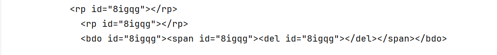

# Filtering Language Modeling Data

## Filtering Common Crawl (CC):

### Inspecting CC:

I downloaded sample files as WARC and WET to get an idea of what a random 
sample would contain.

1. The WARC file contains URLs, metadata, HTTP request details and the 
raw HTML content.
2. The WET file contains only the extracted text parts. However, it's every single text in the page
not just the main content, looking at the WET file all the headers, footers, and buttons should have been 
filtered by the extractor.
3. Looking at more than 25 WET records, it is clear that "high quality" webpages 
are very rare, none of the ones I saw is something I thought LMs were or should be trained on.
it felt like complete gibberish.

Looking at the WET files, I think I can do a better job in HTML to text conversion.

### HTML to text conversion:

To experiment with HTML-to-text conversion, I started from the raw `.warc.gz` files instead of the WET format. 

This allows full control over the parsing and filtering steps. 
I used `fastwarc` to iterate over the `WarcRecordType.response` records, 
and `resiliparse` to detect encoding and extract readable text from HTML.
Full script in `data_filtering/filtering_utilities/extract_text.py`.

At this stage, I only extract text content and write it out to a `.txt` file, 
adding a special delimiter `<|endofdoc|>` after each webpage to explicitly mark document boundaries. 
This is important for downstream training (e.g., language modeling or chunked retrieval) 
and is common practice in datasets like The Pile and C4. 

> Even without filtering, it's clear that a large portion of these documents are boilerplate-heavy, repetitive, or empty. 
Many contain large blocks of whitespace or newline padding. 

The structure I’m writing to looks like this:

```
Some site content...

<|endofdoc|>

Another site...

<|endofdoc|>
```

This preserves boundaries and leaves all options open for filtering and preprocessing in later stages. 
For now, I’m keeping everything including whitespace and adding only minimal structure. 

The full quality pipeline
(deduplication, language ID, harmful content detection, compression stats, length filtering, etc.) 
will come after this raw extraction phase.

> More Inspection:
> + The current extraction still extracts all content, including the headers and footers and so forth; I think I will experiment with more flags inside the `extract_text` function.
> + The extraction is not perfect; I noticed a lot of fragmented HTML tags, mainly those with non-standard names. 
> + There are a lot of languages in the full file, will be interesting to do some language identification.

### Language Identification
